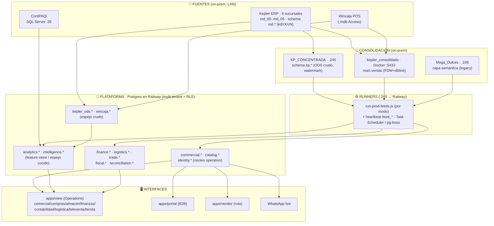
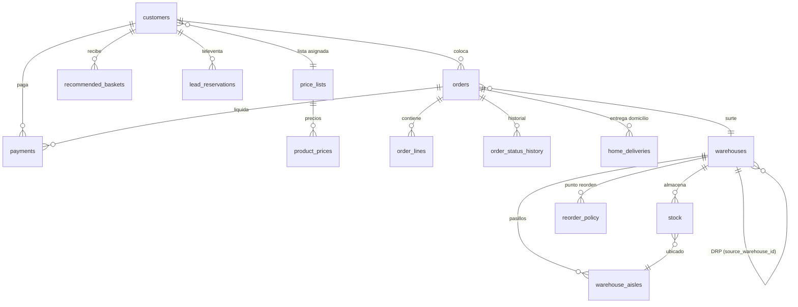
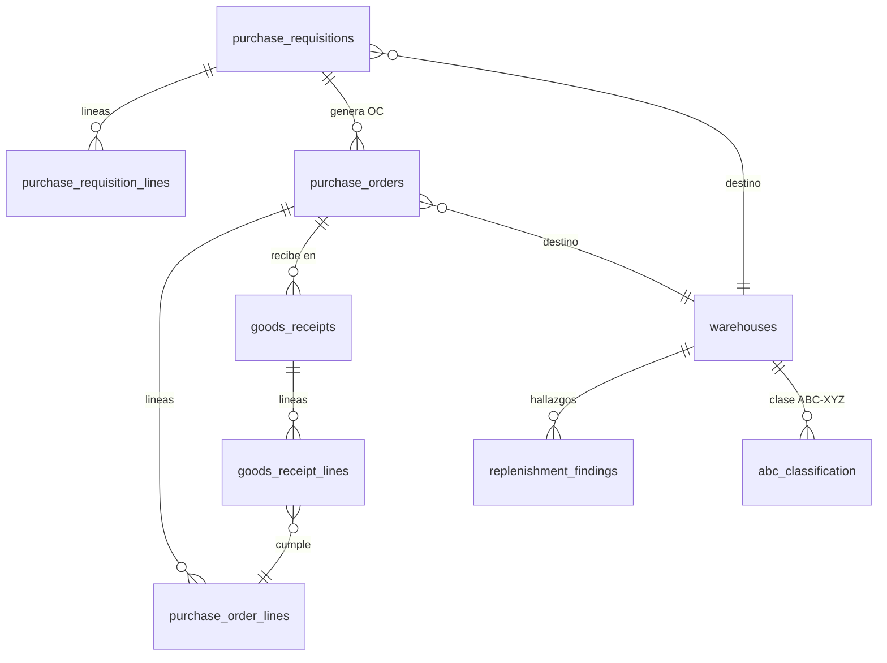
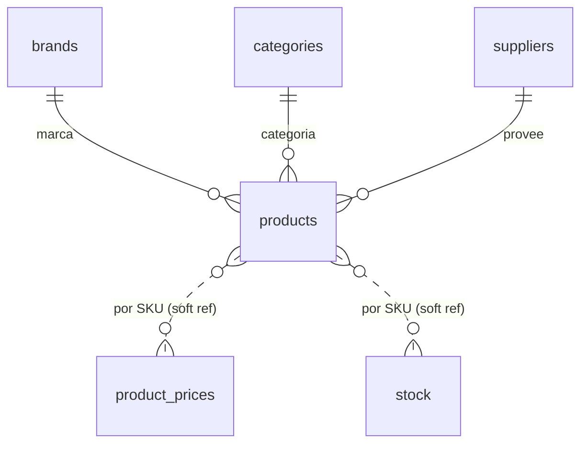
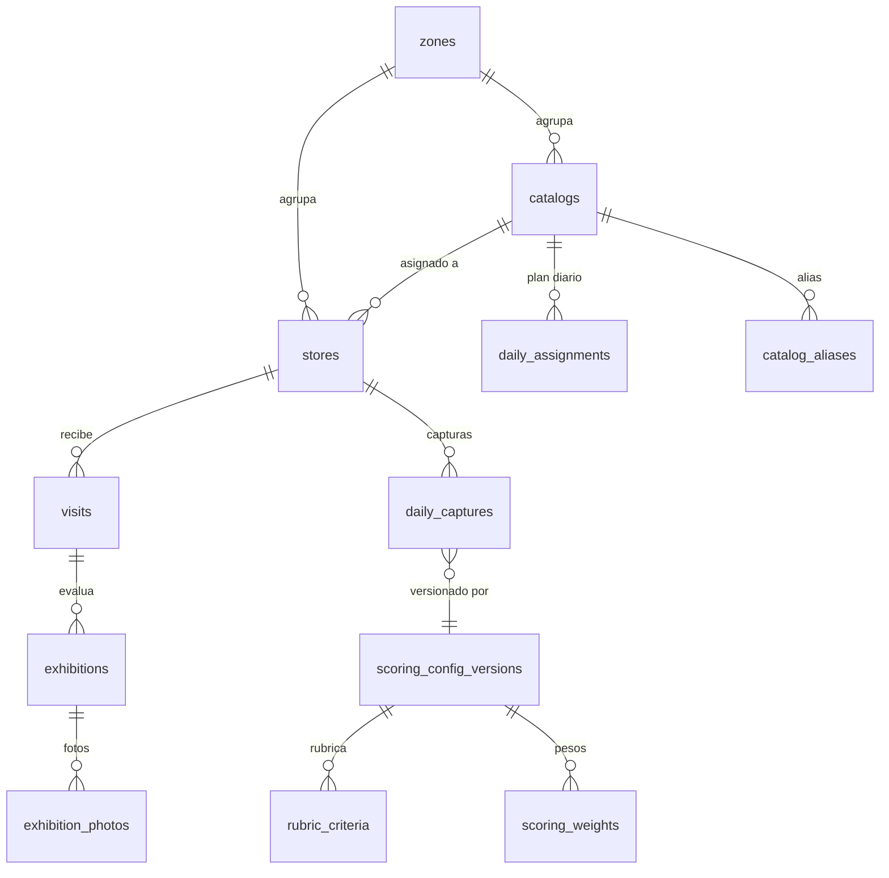
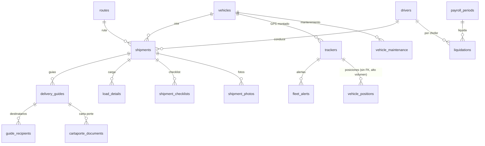
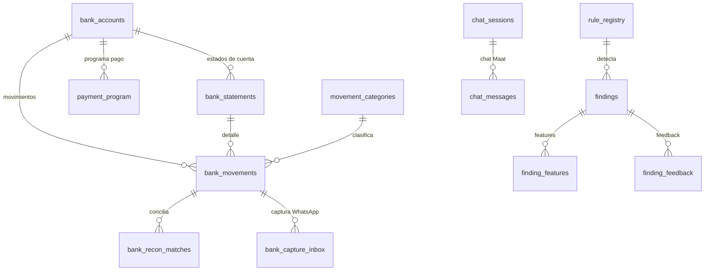
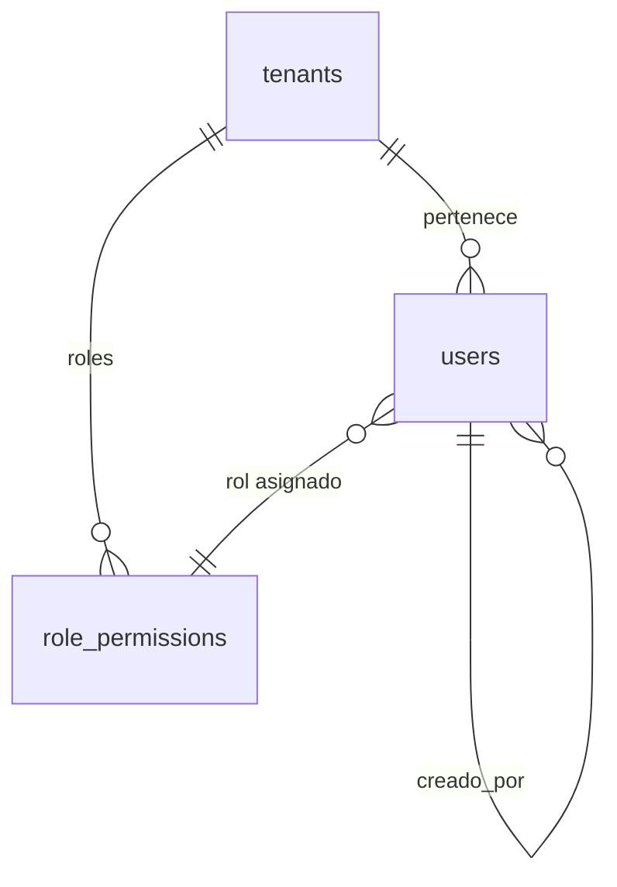
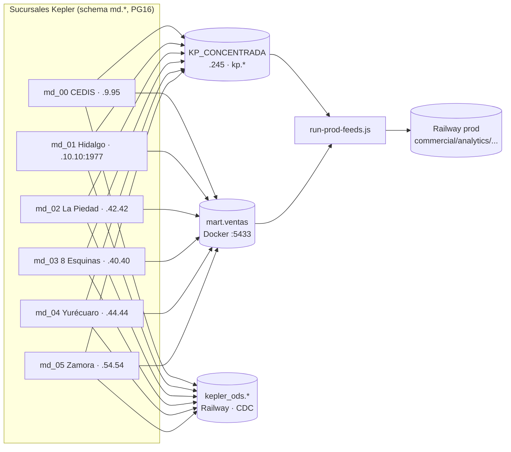

# Arquitectura de datos — Trade Marketing / Plataforma B2B

> Mapa de cómo está organizada la base de datos, las relaciones entre tablas y las
> interfaces que las consumen. **Grounded en la DB de prod** (introspección directa,
> 2026-08-14): 17 schemas · 338 tablas · 135 FKs · 44 vistas/MVs. Los diagramas son
> mermaid (se renderizan en VSCode/GitHub). Regenerar tras cambios grandes de schema.

---

## 1. Vista de capas (de dónde viene el dato hasta la pantalla)

La plataforma **no tiene un ERP propio**: el dato transaccional nace en **Kepler**
(6 sucursales, cada una su Postgres) y en **Wincaja** (POS), se **consolida** on-prem,
y se **empuja** a la DB de la plataforma en Railway, que es la que sirve a las apps.



**Regla de oro:** las apps SIEMPRE leen de la DB de la plataforma (Railway), nunca de
Kepler/Wincaja directo. La frescura de cada eslabón se vigila en `/admin/db-health`.

---

## 2. Catálogo de schemas

| Schema | Tablas | Propósito | Tablas clave | Consumido por |
|---|---:|---|---|---|
| **commercial** | 91 | Núcleo operativo B2B: pedidos, clientes, stock, compras, precios | `orders`, `order_lines`, `customers`, `stock`, `warehouses`, `product_prices`, `purchase_requisitions` | comercial, compras, almacen, portal, vendor, televenta |
| **analytics** | 63 | Feature store + espejo "cocido" del ERP (ventas, movimientos, contable) | `sales_daily`, `stock_movements`, `gl_poliza_lines`, `contpaqi_*`, `caja_depositos`, `store_live_tickets` | dashboard, comercial, finanzas, contabilidad |
| **finance** | 31 | Bancos, conciliación, Maat (AI), pagos, hallazgos | `bank_movements`, `bank_recon_matches`, `findings`, `payment_program`, `chat_sessions` | finanzas |
| **wincaja** | 29 | Espejo POS Wincaja (ventas, existencias, clientes) | `detalles_mov_almacen` (9.8M), `maestro_mov_almacen`, `v_sales_lines` | tienda, comercial (sell-out) |
| **logistics** | 28 | Embarques, flota, choferes, guías, GPS, nómina | `shipments`, `vehicles`, `drivers`, `delivery_guides`, `vehicle_positions`, `trackers` | logistica |
| **trade** | 18 | Auditoría de ejecución en PdV (el negocio original) | `stores`, `visits`, `exhibitions`, `daily_captures`, `catalogs`, `zones` | projects (auditoría), dashboard |
| **fiscal** | 16 | CFDI, SAT, EFOS, materialidad | `cfdis`, `sat_list_rfcs` (536k), `rfc_issues` | contabilidad |
| **pgboss** | 12 | Cola de jobs del orquestador de feeds | `job`, `schedule`, `queue`, `archive` | feed-worker (orquestador) |
| **kepler_ods** | 11 | Espejo crudo Kepler al minuto (CDC) | `kdm2` (3.4M), `kdij`, `kdm1`, `kdii` | feeds analytics, live |
| **whatsapp** | 9 | Bot conversacional, campañas, optin | `messages`, `conversation_threads`, `campaigns` | WhatsApp bot |
| **catalog** | 6 | Catálogo maestro de productos | `products` (14.7k), `brands`, `categories`, `suppliers` | comercial, portal, vendor |
| **identity** | 5 | Multi-tenant, usuarios, permisos | `tenants`, `users`, `role_permissions` | auth (todas) |
| **reconciliation** | 5 | Motor de discrepancias (recon tasks) | `discrepancies`, `rule_registry` | finanzas |
| **inventory** | 4 | Vistas/espejo de inventario físico | `products`, `warehouse_stock`, `products_active` | almacen |
| **intelligence** | 4 | Feature store de Thot (afinidad, zona, PdV) | `product_affinity`, `zone_demand`, `pdv_presence` | comercial (Thot) |
| **public** | 5 | Migraciones + tracking GPS crudo + vistas legacy | `route_location_pings`, `knex_migrations` | logistica, sistema |
| **erp** | 1 | Foreign tables FDW hacia Mega_Dulces (legacy) | `staff` | (transición) |

> Además existen los schemas de **vistas** `analytics_external` (`ventas_legacy` FDW) y
> `public.*` (vistas passthrough para compatibilidad de field_ops).

---

## 3. Diagramas de relaciones por dominio

### 3.1 `commercial.*` — núcleo operativo (pedidos + stock + compras)



### 3.2 `commercial.*` — compras / reabastecimiento (RA)



### 3.3 `catalog.*` — catálogo maestro


> Nota: `commercial.*` referencia `catalog.products` por `(tenant_id, sku)` **sin FK
> declarada** (frontera entre schemas + RLS) — de ahí las "soft ref" punteadas.

### 3.4 `trade.*` — auditoría de ejecución en PdV (negocio original)



### 3.5 `logistics.*` — embarques, flota y GPS



### 3.6 `finance.*` — bancos, conciliación y Maat (AI)



### 3.7 `identity.*` — multi-tenant y permisos


> Todas las tablas de negocio llevan `tenant_id` + **RLS forzado** en Postgres. El
> `tenant_id` es el discriminador multi-tenant; `TenantKnexService.run()` es obligatorio
> para que las queries vean filas.

---

## 4. `analytics.*` — el feature store (poca FK, mucho volumen)

Es intencionalmente **desnormalizado** (espejo cocido del ERP + agregados), por eso casi
no tiene FKs: cada tabla es un "hecho" que alimenta un tablero. Se llena por los feeds
(`run-prod-feeds.js`). Familias:

| Familia | Tablas | Alimenta |
|---|---|---|
| **Ventas** | `sales_daily` (4.3M), `sales_monthly`, `product_sales_daily/monthly`, `sales_by_vendor_monthly`, `sales_boxes_monthly` | Command Center, sell-out, Thot |
| **Inventario** | `stock_movements` (3.5M), `product_sales_stats`, `purchase_velocity`, `purchase_in_transit` | almacen, compras (RA) |
| **Contable** | `gl_polizas`, `gl_poliza_lines` (448k), `ledger_monthly`, `expense_doc_chain` | contabilidad, Maat |
| **ContPAQi** | `contpaqi_bank_movements` (151k), `contpaqi_ledger_monthly`, `contpaqi_suppliers` | finanzas (vs ContPAQi) |
| **Caja / cobranza** | `caja_depositos` (218k), `erp_collections`, `erp_supplier_payments`, `erp_goods_receipts` | finanzas, compras |
| **Tienda / GPS** | `store_live_tickets` (126k), `route_push_lines` | tienda, comercial |
| **Salud/ops** | `cron_runs`, `db_health_alerts` | /admin/db-health |
| **MVs (@15min)** | `mv_sales_overview_30d`, `mv_top_customers_30d`, `mv_top_products_30d` | Command Center |

---

## 5. Interfaces que consumen las tablas

Backend en **libs de dominio** (NestJS); el `apps/api` solo tiene módulos delgados
(auth, cron, db-health, store, tenants). Frontend en 3 apps: **view** (Operations),
**portal** (B2B) y **vendor** (ruta).

| Interfaz (frontend) | Módulo backend (lib) | Schemas / tablas que lee-escribe |
|---|---|---|
| **/comercial** (Command Center, clientes, pedidos, Thot) | `commercial-analytics`, `-orders`, `-customers`, `-pricing`, `-intelligence` | `commercial.orders/order_lines/customers/product_prices`, `analytics.sales_*` + MVs, `intelligence.*` |
| **/compras** (existencia crítica, requisiciones, red) | `commercial-replenishment` | `commercial.reorder_policy/purchase_*/replenishment_findings`, `analytics.purchase_*` |
| **/almacen** (stock, movimientos, caducidad, conteo) | `commercial-inventory`, `-movements`, `-expiry-reviews` | `commercial.stock/stock_lots/inventory_count_*`, `analytics.stock_movements`, `inventory.*` |
| **/finanzas** (bancos, Maat, pagos, cobranza) | `libs/finance` (`bank`, `maat`, `pagos`, `collection-deposits`, `payment-program`) | `finance.*`, `analytics.caja_depositos/erp_*/contpaqi_*` |
| **/contabilidad** (pólizas, CFDI, SAT, materialidad) | `libs/fiscal`, `finance/polizas` | `fiscal.*`, `analytics.gl_poliza*`, `finance.kepler_accounts` |
| **/logistica** (embarques, flota, rastreo, nómina) | `libs/logistics` (13 submódulos) | `logistics.*`, `public.route_location_pings` |
| **/televenta** (cola de leads, llamadas) | `commercial-televenta` | `commercial.call_logs/lead_reservations/customers` |
| **/reparto** (última milla, liquidación rider) | `commercial-home-delivery`, `-rider-liquidation` | `commercial.home_deliveries/payments`, `logistics.*` |
| **/tienda** (POS en vivo) | `apps/api/modules/store` | `analytics.store_live_tickets`, `wincaja.*` |
| **/projects** (auditoría de ejecución) | `libs/trade` (`shared-scoring`) | `trade.stores/visits/exhibitions/daily_captures/scoring_*` |
| **/dashboard** (Command Center + Salud BD) | `commercial-analytics`, `db-health` | MVs `analytics.*`, `analytics.cron_runs/db_health_alerts` |
| **apps/portal** (B2B self-service) | `commercial-orders`, `-pricing`, `-recommendations`, `portal-ai-order` | `commercial.orders/product_prices/recommended_baskets`, `catalog.products` |
| **apps/vendor** (toma de pedido en ruta) | `commercial-vendor-routes`, `-vendor-sales` | `commercial.orders/customers/vendor_visits`, `trade.stores` |
| **WhatsApp bot** | `libs/whatsapp` | `whatsapp.*`, `commercial.orders` (crea intake) |

---

## 6. Fuentes y consolidación (detalle on-prem)



- **KP_CONCENTRADA** (`.245`, schema `kp.*`): ODS crudo de las 6 sucursales, una tabla
  por tabla-fuente + columna `sucursal`, con watermark incremental. Cada 4h.
- **mart.ventas** (Docker `:5433`): solo ventas, FDW+dblink, refresco cada 2 min.
- **kepler_ods** (Railway): espejo crudo, tablas `kdm1/kdm2/…` con columna `sucursal`. Se alimenta en
  **tres saltos** — POS en LAN → replicación lógica → réplicas `:5433/kepler_md_XX` (schema `md`) →
  shipper HTTP a prod. El tercer salto **no puede** ser replicación nativa (es *pull* y los POS no
  tienen IP pública; y hace *fan-in* de 7 fuentes a una tabla): por eso hay un proceso.
  Ese proceso vive **sólo en Docker** (`ops/ingest/docker-compose.yml`: `ods-live-hot` @15 s,
  `ods-live-mirror` @300 s, `ods-reconcile` @15 min, más `autoheal`). **Un carril = UN dueño**: ni
  Task Scheduler ni PM2 vuelven a levantar un shipper del ODS — tenerlo por triplicado dejó un carril
  15 h colgado en verde el 2026-09-04. Topología, convención de nombres (ojo: la rama **03** vive en
  `kepler_pilot`) y las trampas, en [`GOTCHAS.md` §35-§36](GOTCHAS.md).
- Mapa de conexión/creds de las sucursales: ver runbook interno (no versionado).

---

## 7. Cómo regenerar este documento

La estructura real se obtiene por introspección (schemas, tablas, FKs, vistas) contra la
DB de prod:

```sql
-- schemas + conteo
SELECT n.nspname, count(*) FROM pg_class c JOIN pg_namespace n ON n.oid=c.relnamespace
WHERE c.relkind IN ('r','p') AND n.nspname NOT LIKE 'pg_%' AND n.nspname<>'information_schema'
GROUP BY 1 ORDER BY 2 DESC;

-- relaciones (FK edges)
SELECT tc.table_schema, tc.table_name, ccu.table_schema, ccu.table_name
FROM information_schema.table_constraints tc
JOIN information_schema.constraint_column_usage ccu
  ON tc.constraint_name=ccu.constraint_name AND tc.table_schema=ccu.table_schema
WHERE tc.constraint_type='FOREIGN KEY';
```

El mapa de interfaces sale de `libs/*/src/lib/*` (backend por dominio) y
`apps/{view,portal,vendor}/src/app/modules/*` (frontend).
