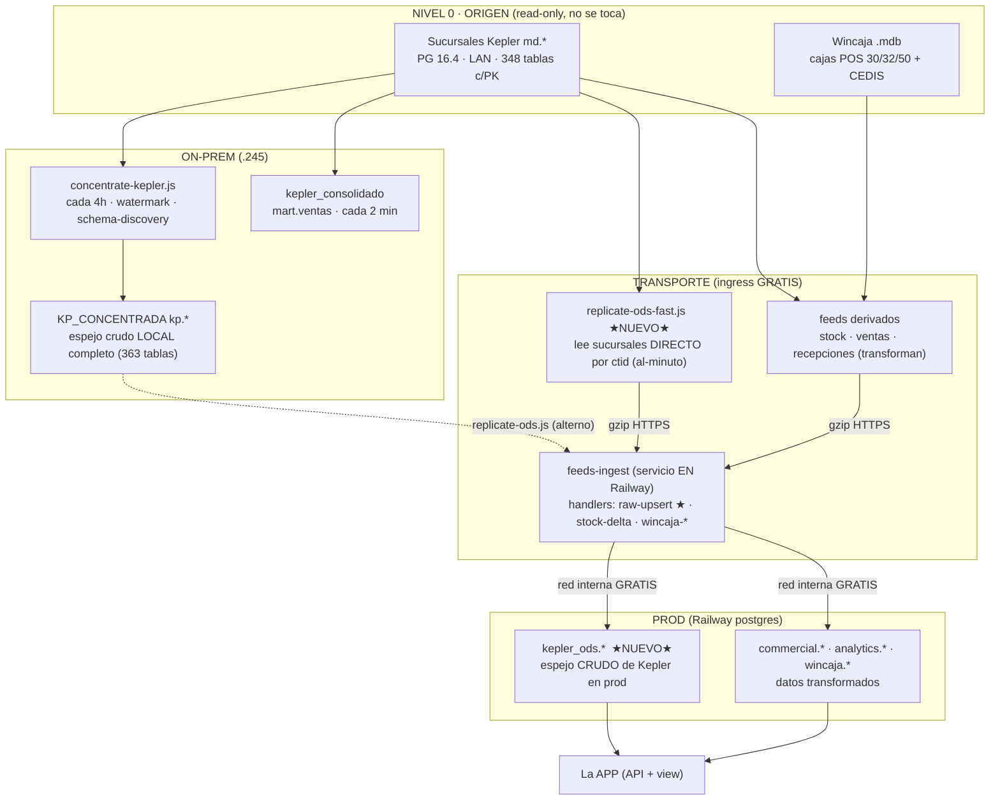

# Arquitectura de datos — cómo funcionan nuestras bases, el flujo y qué es nuevo

> Vista de pájaro de TODAS las bases de datos del proyecto, cómo se mueve el dato de origen a la app,
> qué se construyó (pipe CDC al-minuto) y qué se quedó igual.
>
> **Última actualización:** 2026-08-11 (SYNC.2 + vía rápida ctid)

---

## 1. Las bases que tenemos (inventario)

| Base | Dónde | Qué es | Rol |
|---|---|---|---|
| **Sucursales Kepler** (`md_00`…`md_05`) | ~6 Postgres en la LAN (PG **16.4**) | El **ERP origen**. Schema `md.*` ofuscado (`kdXX` / `cN`), 348 tablas, **cada una con PK**. Read-only (`platform_ro`). | Verdad de la operación. NO se toca. |
| **Wincaja (POS)** | Access `.mdb` (Jet 32-bit) en las cajas | Origen de las sucursales wincaja-only (30/32/50) + CEDIS. Medallion bronze/silver/gold. | Origen POS. NO se toca. |
| **KP_CONCENTRADA** | `192.168.0.245` (PG 18) | **Espejo crudo local** de TODAS las sucursales: `md.*` → `kp.*` (363 tablas, ~7 GB). Watermark en `kp.sync_control`. | ODS local completo. |
| **kepler_consolidado** | `.245` Docker `:5433` | Mart de ventas (`mart.ventas`), refresca cada 2 min. | Analítica de ventas rápida. |
| **postgres_platform** | `.245`/`:5433` dev · **Railway = PROD** | La **DB de la app** (multi-tenant): `commercial.*`, `analytics.*`, `catalog.*`, `finance.*`, `logistics.*`, `wincaja.*` y ahora **`kepler_ods.*`**. | Lo que consume la app. |
| **DB legacy** | Railway | La base vieja, en paralelo hasta cutover. | Histórico. |

---

## 2. El flujo (de origen a app)

**Idea central del transporte:** el runner on-prem **nunca escribe al proxy público** de Railway (eso
factura *egress*). Empuja el changeset comprimido por **HTTPS (ingress = GRATIS)** al servicio
`feeds-ingest`, que vive **dentro** de Railway y escribe por **red interna (gratis)**. Un solo servicio,
aislado del API (que sufre OOM), con el SQL de escritura como única fuente de verdad (`apply-handlers.js`).

---

## 3. Lo NUEVO (2026-08-11 · Fase SYNC.2)

1. **`kepler_ods.*` en prod** — un **espejo crudo de Kepler** consultable directo desde la app.
   Antes prod solo tenía datos **transformados**; el crudo vivía únicamente on-prem (`.245`).
2. **Handler `raw-upsert`** (en `feeds-ingest`) — CDC **genérico, tabla-agnóstico**: descubre PK y
   columnas solo, auto-crea/auto-altera la tabla, y hace **UPSERT sin churn**
   (`ON CONFLICT (sucursal, PK) DO UPDATE … WHERE IS DISTINCT FROM` → **solo escribe lo que cambió**).
3. **Dos replicadores:**
   - `replicate-ods.js` — lee `KP_CONCENTRADA` (`kp.*`) → prod. Watermark `_loaded_at`. (Alterno / otras tablas.)
   - **`replicate-ods-fast.js`** (el al-minuto) — lee las **sucursales DIRECTO** por **watermark `ctid`**,
     un salto branches→prod sin depender del concentrate de 4h.
4. **Watermark por `ctid`** — verificado que las sucursales son **PG 16.4** → `WHERE ctid > '(b,o)'::tid`
   es **Tid Range Scan** (lee solo bloques nuevos, NO seq-scan de millones). Control en
   `kp.ods_fast_control` (en `.245`, **no toca prod → cero egress**). Captura INSERT+UPDATE.
5. **Cadencia** — tarea oculta `\Kepler\OdsReplicate` cada 2 min (runner `.vbs` invisible).
6. **db-health** — check `kepler_ods` sobre `_sync_status.last_push_at` (detecta si el pipe se detuvo).

### Tablas curadas que se replican al-minuto (11)
`kdm1` (docs cabecera) · `kdm2` (docs líneas) · `kdii` (productos) · `kdil` (existencia) ·
`kdig` (líneas/marcas) · `kdik` (costo) · `kdib` · `kdid` · `kdij` · `kdue` · `kduv` (rutas vecinales).

> Agregar una tabla = 1 línea en `KP_ODS_TABLES`. Motor genérico, cero código por tabla.
> Scope curado a propósito (no las 363/7 GB) para no gastar CPU diffeando tablas que no se consultan.

### Semántica de `sucursal` (importante)
La vía rápida inyecta `sucursal = sucursal-que-lee`, **igual que concentrate**. Como algunas sucursales
arrastran réplicas de otras (`md_03` tiene sus docs + réplica de `md_02`), los totales cuadran con `kp.*`
(~3.4M en `kdm2`) — **no hay inflado**. Para "des-duplicar" al consultar, se filtra `c1 = nº-sucursal`.

### Limitaciones (por diseño, aceptadas)
- **Hard-DELETE** en origen no se propaga (UPSERT no borra; raro en un ERP). El `--full` nightly reconcilia.
- **VACUUM FULL** reescribe ctids → correr `--full` (nightly) resincroniza. `autovacuum` normal NO mueve tuplas vivas.

---

## 4. Lo que SE QUEDÓ (sin cambios)

- **Sucursales Kepler y Wincaja** como origen (read-only, intactos).
- **`concentrate-kepler` (cada 4h)** → sigue mateniendo el **espejo local completo** `KP_CONCENTRADA`
  (las 363 tablas). La vía rápida lo **bypassa** para prod, pero el espejo local completo sigue vivo.
- **`kepler_consolidado`** mart de ventas (2 min).
- **Feeds derivados** de negocio (stock, ventas, recepciones…) que ya estaban al-minuto por sus rutas dedicadas.
- La **app consume prod** igual que antes; `kepler_ods.*` es dato **adicional**, no reemplaza nada.

---

## 5. En una frase

**Antes:** prod solo tenía datos **transformados**; el espejo crudo de Kepler vivía únicamente on-prem
(`.245`), refrescado cada 4h.
**Ahora:** prod también tiene un **espejo crudo de Kepler** (`kepler_ods.*`) que se actualiza **al minuto**
leyendo las sucursales directo por `ctid`, **sin costo de egress** y **sin reescribir lo que no cambió**.

---

## Archivos clave

| Archivo | Rol |
|---|---|
| `services/feeds-ingest/server.js` | Servicio de ingesta en Railway (`POST /ingest/:feed`, gzip, auth) |
| `services/feeds-ingest/apply-handlers.js` | **Única fuente del SQL de escritura**. Handlers `raw-upsert`, `stock-delta`, `wincaja-*` |
| `database/importers/kepler/replicate-ods-fast.js` | Vía rápida al-minuto (sucursales→prod por ctid) |
| `database/importers/kepler/replicate-ods.js` | Replicador alterno (`kp.*`→prod por `_loaded_at`) |
| `database/importers/kepler/concentrate-kepler.js` | Espejo local completo (sucursales→`KP_CONCENTRADA`) |
| `database/importers/lib/sink.js` | Decide transporte `pg` (proxy) vs `http` (ingress) |
| `database/migrations-newdb/20260811120000_kepler_ods_schema.js` | Schema `kepler_ods` + grants |
| `C:\KeplerRunner\run-ods.cmd` + `run-ods-hidden.vbs` | Runner oculto (tarea `\Kepler\OdsReplicate` PT2M) |

Relacionado: [`FASES/FASE_SYNC_TIEMPO_REAL.md`](FASES/FASE_SYNC_TIEMPO_REAL.md) · [`ERP_KEPLER_SCHEMA.md`](ERP_KEPLER_SCHEMA.md) · [`KEPLER_CONSOLIDADO_PROD.md`](RUNBOOKS/KEPLER_CONSOLIDADO_PROD.md)
